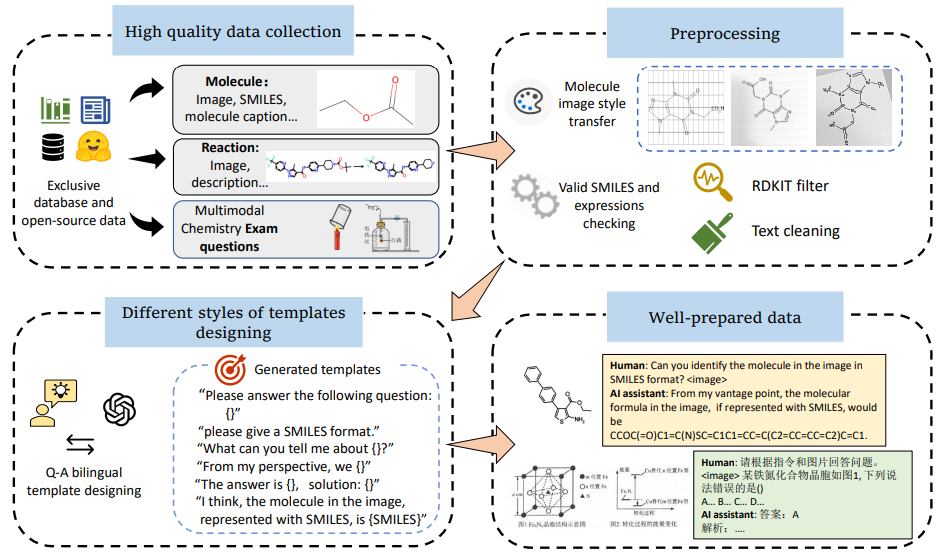
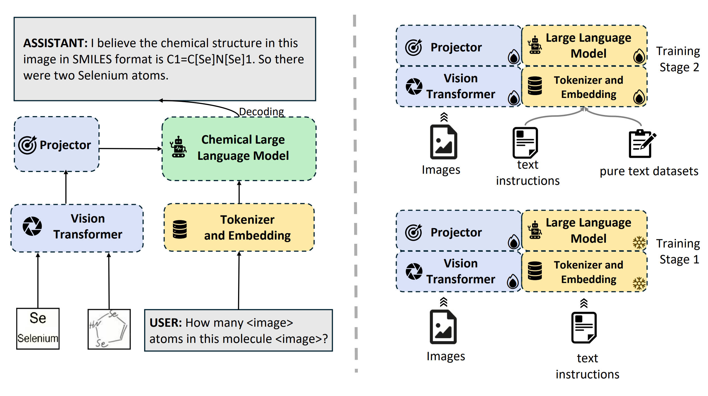

# # [🏆AAAI2025] ChemVLM: Exploring the Power of Multimodal Large Language Models in Chemistry Area.    
This is the official repo for our paper: ChemVLM: Exploring the Power of Multimodal Large Language Models in Chemistry Area.  

<div>
<a href="https://ojs.aaai.org/index.php/AAAI/article/view/32020"></a>
<a href="https://arxiv.org/abs/2408.07246"></a>
<a href="https://github.com/lijunxian111/ChemVlm" target='_blank' style="text-decoration: none;"></a>
<a href="https://github.com/lijunxian111/ChemVlm/stargazers" target='_blank' style="text-decoration: none;"></a>
<a href="https://migo-chem.intern-ai.org.cn/"></a>
</div>

## Reference  
If using our model or datasets or any other purposes, please kindly cite:

```
@inproceedings{li2025chemvlm,
  title={Chemvlm: Exploring the power of multimodal large language models in chemistry area},
  author={Li, Junxian and Zhang, Di and Wang, Xunzhi and Hao, Zeying and Lei, Jingdi and Tan, Qian and Zhou, Cai and Liu, Wei and Yang, Yaotian and Xiong, Xinrui and others},
  booktitle={Proceedings of the AAAI Conference on Artificial Intelligence},
  volume={39},
  number={1},
  pages={415--423},
  year={2025}
}
```

## Abstract

Large Language Models (LLMs) have achieved remarkable success and have been applied across various scientific fields, including chemistry. However, many chemical tasks require the processing of visual information, which cannot be successfully handled by existing chemical LLMs. This brings a growing need for models capable of integrating multimodal information in the chemical domain. In this paper, we introduce **ChemVLM**, an open-source chemical multimodal large language model specifically designed for chemical applications. ChemVLM is trained on a carefully curated bilingual multimodal dataset that enhances its ability to understand both textual and visual chemical information, including molecular structures, reactions, and chemistry examination questions. We develop three datasets for comprehensive evaluation, tailored to Chemical Optical Character Recognition (OCR), Multimodal Chemical Reasoning (MMCR), and Multimodal Molecule Understanding tasks. We benchmark ChemVLM against a range of open-source and proprietary multimodal large language models on various tasks. Experimental results demonstrate that ChemVLM achieves competitive performance across all evaluated tasks. Our code is available at [https://github.com/lijunxian111/ChemVlm](https://github.com/lijunxian111/ChemVlm).

## Data

We have released our **training** data at: **https://huggingface.co/datasets/di-zhang-fdu/chemvlm-sft-datasets.**  
Some pure text data and exam data are here:  
https://huggingface.co/collections/di-zhang-fdu/multi-corpus-datasets-for-chemllm-66e7f14fd683a3f4e51d737b   
https://huggingface.co/AI4Chem/ChemExam-mm-data-parts  
Usually, you can use the first link only to finetune your model for better multi-modal chemistry ability.  

If you use them, please kindly star our github and huggingface repo and cite our paper. That will be of great help!  



## Model

Use our model at: https://huggingface.co/AI4Chem.    
Our best model is at: [AI4Chem/ChemVLM-26B-1-2](https://huggingface.co/AI4Chem/ChemVLM-26B-1-2).  

The architecture of our model is as follows.



## Training

Before using our model, you should run:  
```
pip install -r requirements.txt  
```


Our training refers to the InternVL-v1.5 repo. You can find it at https://internvl.readthedocs.io/en/latest/internvl1.5/finetune.html. Create a folder named 'InternVL' under root directory and follow their instructions. Note that you should first run:  
```
CUDA_VISEBLE_DEVICES=xxx python merge_vit_and_llm.py
```
to get the initial ChemVLM model checkpoint without training.  

If you use them, please kindly star our github and huggingface repo and cite our paper. That will be of great help!  

## Evaluation  
Huggingface link: [https://huggingface.co/datasets/Duke-de-Artois/ChemVLM_test_data](https://huggingface.co/datasets/Duke-de-Artois/ChemVLM_test_data)  
Our proposed benchmarks are in the ```datagen``` folder:  
```
MMChemOCR: datagen/mm_chem_ocr.jsonl.test.jsonl
MMCR-bench: datagen/mm_pure_fix.jsonl
MMChemBench(mol-caption):  datagen/chembench_mol2caption.jsonl
MMChemBench(property-prediction: datagen/chembench_property.jsonl 
```
You can find the results generation files in the ```evaluation``` folder.  
For SMILES ocr task(MMChemOCR), see both evaluation/test_chemvlm_res.py and evaluation/test_smiles_ocr.py;    
for other tasks, see evaluation/test_chemvlm_res.py.(Some other tasks we add after paper submission is also here.)

Steps:  
1. Create an 'image' folder under the root dir. 
2. Get the image files by:  
Download MMChemOCR <a href='https://drive.google.com/file/d/12KT8rEp16tC43KTbnX9cmX_O4cSmSzYQ/view?usp=sharing'>here</a>.  
Download MMChemBench <a href='https://drive.google.com/file/d/1Kw-T5ltPL7ewEYlf7XhI-Zuwah-sqvil/view?usp=sharing'>mol2caption</a>, <a href='https://drive.google.com/file/d/1yQl26RMQON3ArvxUN1euKIrl1FH8PqH3/view?usp=sharing'>property</a>.  
Dropping a letter <a href='mailto:ljx201806@gmail.com'>here</a> for MMCR-bench.   
Put them under the image folder. Like this: 'image/chem_ocr/...'. Remember to keep the initial name of the folder!('mm_pure_fix' refers to MMCR-bench)   
4. Use test_chemvlm_res.py to generate answers to questions.  
5. For SMILES ocr task, use test_smiles_ocr.py for exact scores of answers. For MMCR tasks, use GPT series as a judge to calculate scores. For MMChemBench, you can read scores easily through read_multiple_choice_scores.py since they are multiple choice problems.

### Update:  
A more effient way to evaluate performance is to use the evluation_tool folder.  
```
Generate a result file: args.stage --generation  
Give scores to the results: args.stage --score  
Both thing done in one round: args.stage --both  
```
You can also determine the dataset type and model type, etc.

### Demo
You can try <a href='https://migo-chem.intern-ai.org.cn/'>here</a> !
